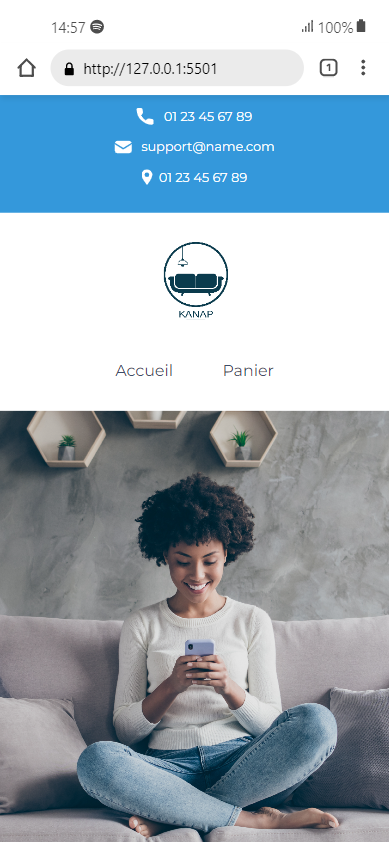

# Kanap

This is the **front end and back end** server for **Project 5** of the **Web Developer path** from **[OpenClassrooms](https://openclassrooms.com/fr/)**.

> **Back end Prerequisites**

You will need to have Node and `npm` installed locally on your machine.

> **Back end Installation**

Clone this repo. From the "back" folder of the project, run `npm install` . You can then run the server with `node server`.

The server should run on `localhost` with default port `3000`. If the server runs on another port for any reason, this is printed to the console when the server starts, e.g. `Listening on port 3001`.

> **Skills assesed in this project**

-   [x] Create a **test plan** for an application
-   [x] Handle **JavaScript events**
-   [x] Interact with a **web service (API)** with JavaScript
-   [x] **Validate data** from external sources

